# OpenBehavior: A Behavior-Centric Scenario Description Language for Autonomous Driving Testing 

<!-- PROJECT LOGO -->

## Examples Video

### S1 T Junction

<details>
<summary><strong>R1-T</strong></summary>

<table>
  <tr>
    <td align="center">
      <br>
      <b>R1-T1</b>
    </td>
    <td align="center">
      <br>
      <b>R1-T2</b>
    </td>
    <td align="center">
      <br>
      <b>R1-T3</b>
    </td>
  </tr>
  <tr>
    <td align="center">
      <br>
      <b>R1-T4</b>
    </td>
    <td align="center">
      <br>
      <b>R1-T5</b>
    </td>
  </tr>
</table>
</details>

### S2 X Junction

<details>
<summary><strong>R1-X</strong></summary>

<table>
  <tr>
    <td align="center">
      <br>
      <b>R1-X1</b>
    </td>
    <td align="center">
      <br>
      <b>R1-X2</b>
    </td>
    <td align="center">
      <br>
      <b>R1-X3</b>
    </td>
  </tr>
</table>
</details>

### S3 Highway

<details>
<summary><strong>R1-L</strong></summary>

<table>
  <tr>
    <td align="center">
      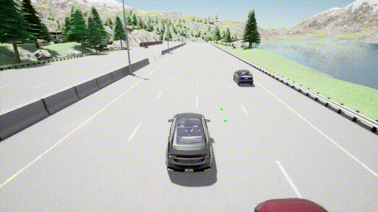<br>
      <b>R1-L1</b>
    </td>
    <td align="center">
      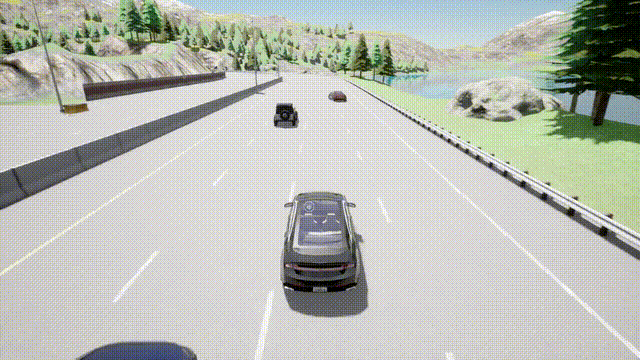<br>
      <b>R1-L2</b>
    </td>
    <td align="center">
      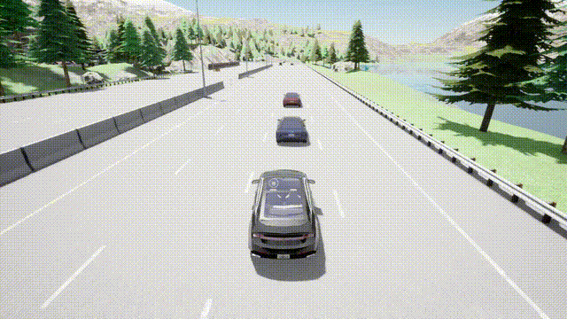<br>
      <b>R1-L3</b>
    </td>
  </tr>
   <tr>
    <td align="center">
      <br>
      <b>R1-L4</b>
    </td>
    <td align="center">
      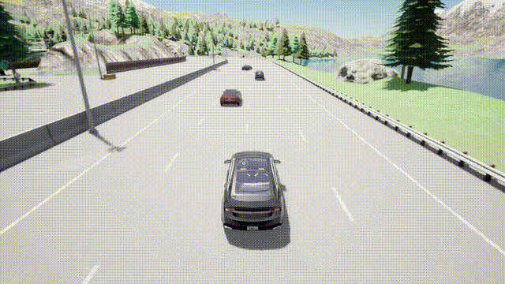<br>
      <b>R1-L5</b>
    </td>
    <td align="center">
      <br>
      <b>R1-L6</b>
    </td>
  </tr>
  <tr>
    <td align="center">
      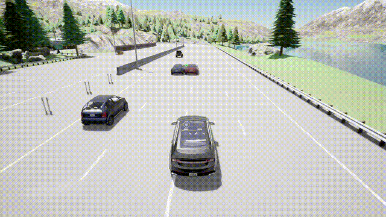<br>
      <b>R1-L7</b>
    </td>
    <td align="center">
      <br>
      <b>R1-L8</b>
    </td>
    <td align="center">
      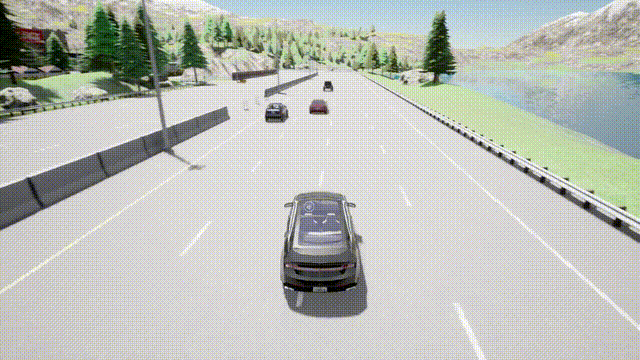<br>
      <b>R1-L9</b>
    </td>
  </tr>
  <tr>
    <td align="center">
      <br>
      <b>R1-L10</b>
    </td>
    <td align="center">
      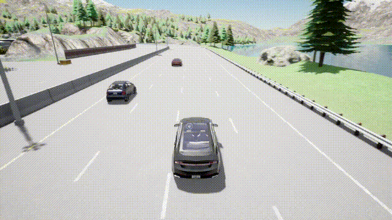<br>
      <b>R1-L11</b>
    </td>
    <td align="center">
      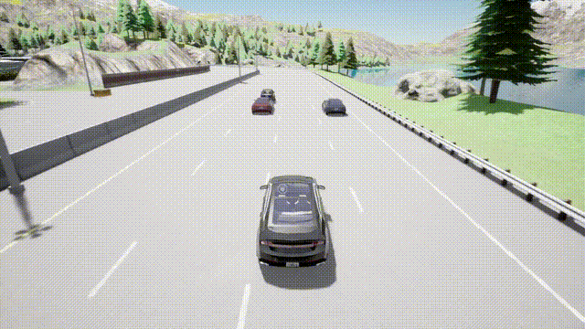<br>
      <b>R1-L12</b>
    </td>
  </tr>
  <tr>
    <td align="center">
      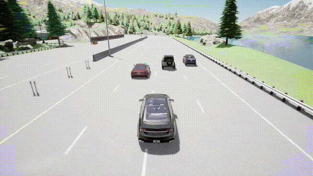<br>
      <b>R1-L13</b>
    </td>
    <td align="center">
      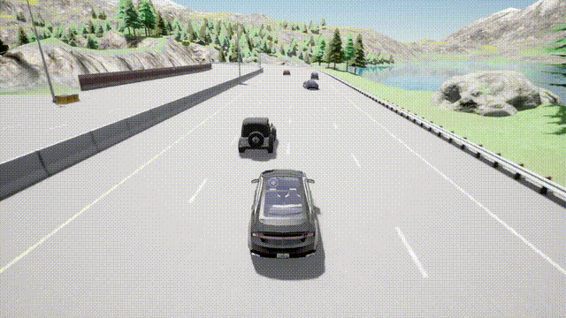<br>
      <b>R1-L13</b>
    </td>
  </tr>
</table>

</details>

### R2 Unable to reach the deatination

<details>
<summary><strong>R2</strong></summary>

<table>
  <tr>
    <td align="center">
      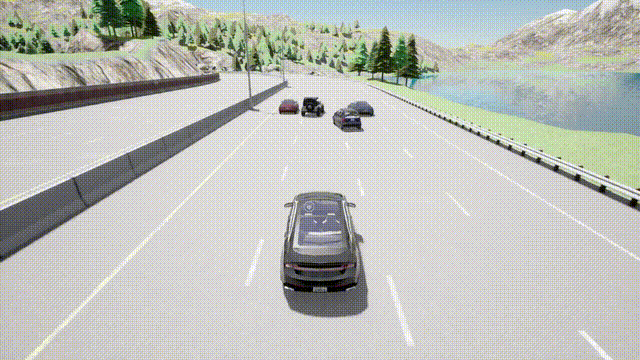<br>
      <b>R2-1</b>
    </td>
    <td align="center">
      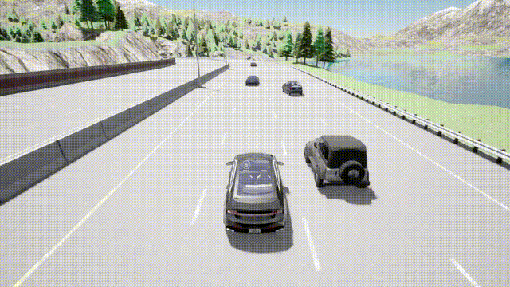<br>
      <b>R2-2</b>
    </td>
    <td align="center">
      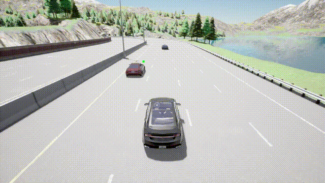<br>
      <b>R2-3</b>
    </td>
  </tr>
</table>

</details>

<div align="center">

<p align="center">
    <br />
    <a href="sunshinesheep.github.io">View Details Demo</a>
  </p>

</div>

<!-- ABOUT THE PROJECT -->

## About The Project

This page presents multiple categories of bugs discovered in the Apollo autonomous driving system.

<!-- GETTING STARTED -->

## Getting Started

This is an example of how you may give instructions on setting up your project locally.
To get a local copy up and running follow these simple example steps.

### Prerequisites

```

### Installation

_Below is an example of how you can instruct your audience on installing and setting up your app. This template doesn't rely on any external dependencies or services._

1. Get a free API Key at [https://example.com](https://example.com)
2. Clone the repo
   ```sh
   git clone https://github.com/github_username/repo_name.git
```
3. Install NPM packages
   ```sh
   npm install
   ```
4. Enter your API in `config.js`
   ```js
   const API_KEY = 'ENTER YOUR API';
   ```
5. Change git remote url to avoid accidental pushes to base project
   ```sh
   git remote set-url origin github_username/repo_name
   git remote -v # confirm the changes
   ```

## Quickstart

**1、Run carla**

```bash
span
```
**2、Start manual_control**

```
python manual_control.py -a --rolename=ego_vehicle
```
**3、Run a OpenSCENARIO 2.0 scenario**

```
python scenario_runner.py --sync  --openscenario2 srunner/examples/cut_in_and_slow_right.osc --reloadWorld 
```

[contributors-shield]: https://img.shields.io/github/contributors/othneildrew/Best-README-Template.svg?style=for-the-badge
