# OpenBehavior: A Behavior-Centric Scenario Description Language for Autonomous Driving Testing

<!-- PROJECT LOGO -->

## [Project Page](http://www.katrinrenz.de/plant) | [Paper](https://arxiv.org/abs/2210.14222) | [Supplementary](https://www.katrinrenz.de/plant/resources/PlanT_supp.pdf) 

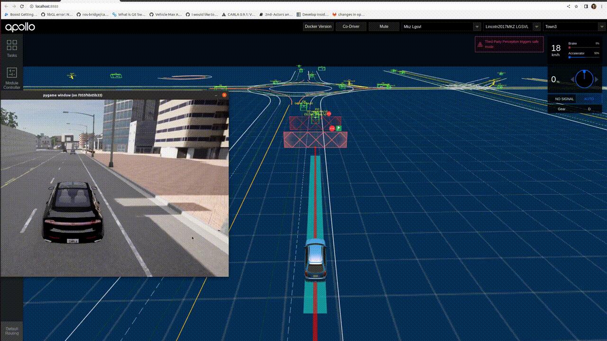
**Figure 1:** *Illustrative scenarios generated by OpenBehavior with different behavior models.*

## Approach Overview
<!-- <p align="center">
  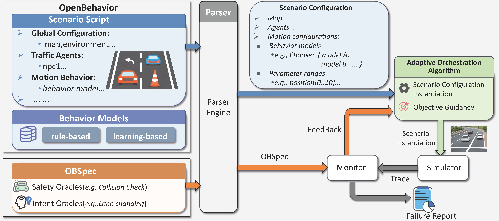
</p> -->

<!-- <center></center> -->


**Figure 2:** *Overview of the OpenBehavior workflow. Users specify scenarios with a behavior-centric language and high-level
scenario intents using OBSpec, which are then instantiated
and adaptively orchestrated to generate interactive scenarios for systematic
testing of the autonomous driving system.*


## Four Functional Scenarios

We evaluate **OpenBehavior** on the following four functional scenarios related to intersections and roads in the real world:

### Scenario Overview

- **S1 – T-Intersection**  
  The ego vehicle goes straight through a T-intersection.

- **S2 – Crossroad Intersection**  
  The ego vehicle turns left at a crossroad intersection.

- **S3 – Lane Following on a Straight Road**  
  The ego vehicle follows its lane on a straight road with four lanes.

- **S4 – Lane Change on a Straight Road**  
  The ego vehicle performs a lane change on a straight road with four lanes.

### Scenario Settings

The illustrations of these four functional scenarios are shown in the figures below.  
<!--During testing:

- The **start position and destination of the ego vehicle** (highlighted by the red route line) are fixed.
- The **trajectories and behaviors of NPC vehicles are not predefined**, allowing diverse and dynamic interactions to emerge during testing. -->


### 🎥 Scenario Failure Demonstrations
### R1: Collision Avoidance
#### T-Junction (R1-T)


| R1-T1 | R1-T2 | R1-T3 |
| :---: | :---: | :---: |
| 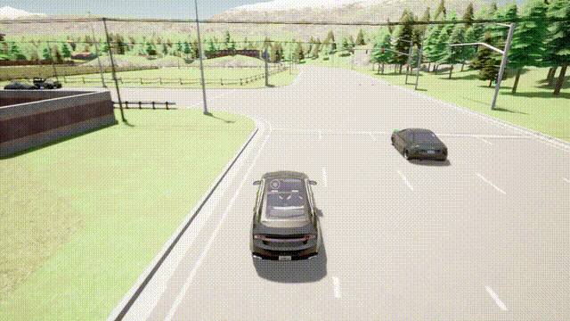 |  |  |
| **R1-T4** | **R1-T5** | |
|  |  | |


#### Crossroad Intersection (R1-X)
<!-- <details> -->

| R1-X1 | R1-X2 | R1-X3 |
| :---: | :---: | :---: |
|  | 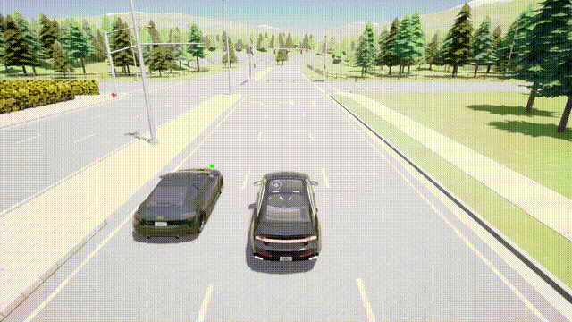 | 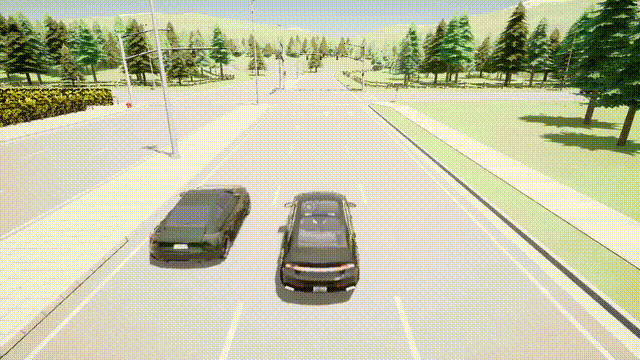 |

<!-- </details> -->

#### Straight Road (R1-L)
<!-- <details> -->

| R1-L1 | R1-L2 | R1-L3 |
| :---: | :---: | :---: |
| 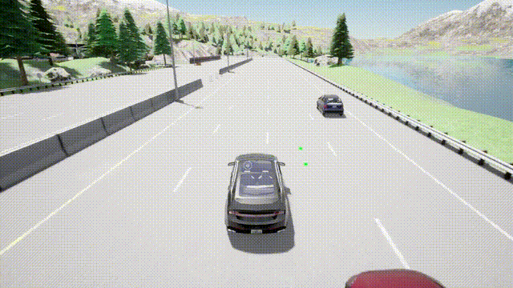 | 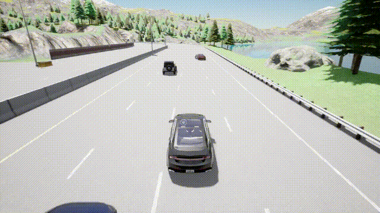 | 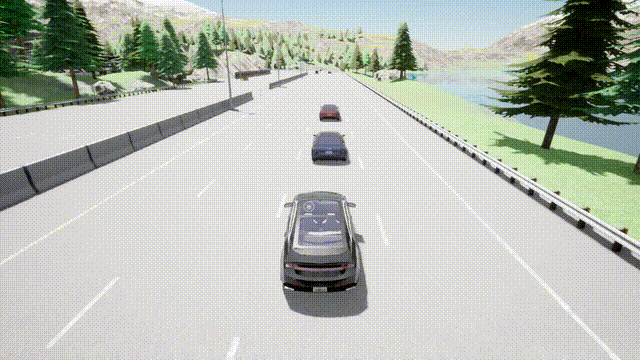 |
| **R1-L4** | **R1-L5** | **R1-L6** |
| 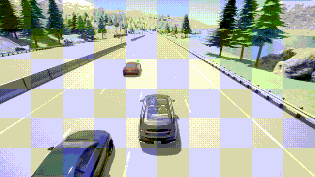 | 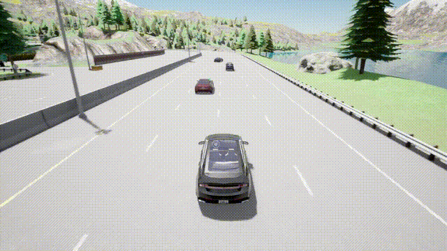 |  |
| **R1-L7** | **R1-L8** | **R1-L9** |
| 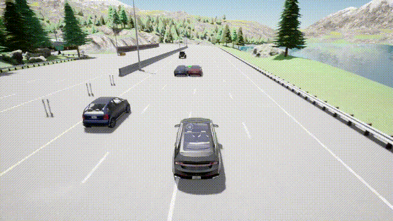 |  | 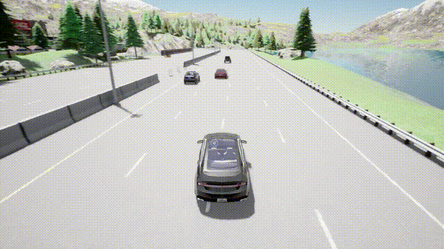 |
| **R1-L10** | **R1-L11** | **R1-L12** |
| 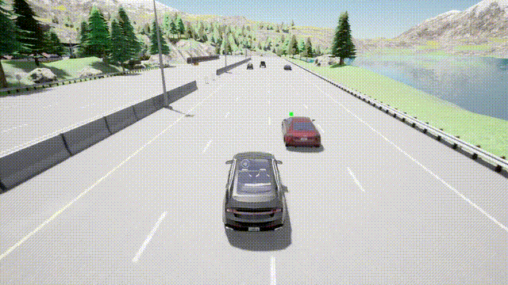 | 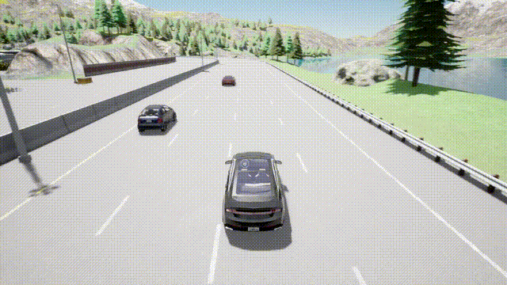 | 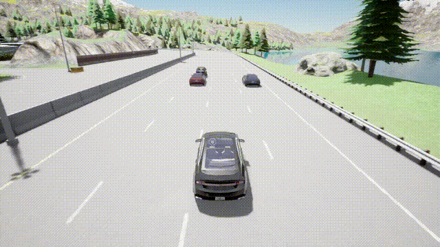 |
| **R1-L13** | **R1-L14** |  |
| 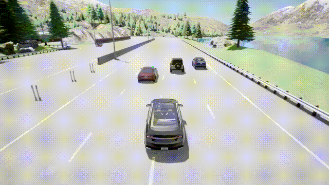 | 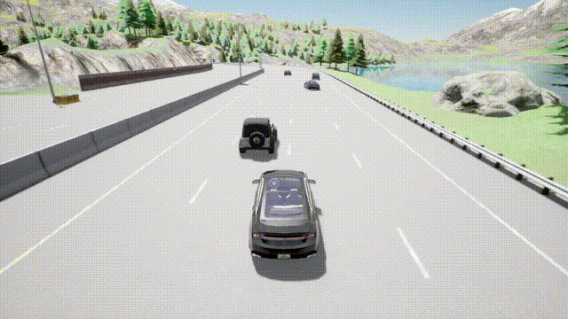 |  |


<!-- </details> -->

### R2: Reaching Destination
<!-- <details> -->
<summary><b> Click to expand R2 Videos</b></summary>

| R2-1 | R2-2 | R2-3 |
| :---: | :---: | :---: |
| 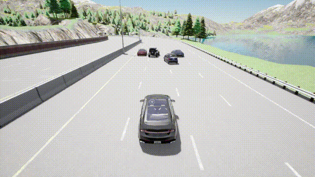 | 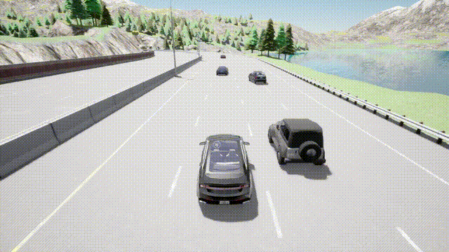 | 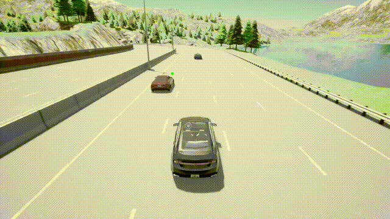 |

<!-- </details> -->


## 📊 Experiment Results

Experimental results demonstrate that OpenBehavior’s behavioral features and designed specifications can uncover 25 interaction-induced failure patterns in Apollo, outperforming existing approaches.

Experiment records are available in the `experiment_result `folder.

<!-- GETTING STARTED -->

## 🚀 Getting Started

### Experiment Setup

1. Install Carla(0.9.13)

   - Download from https://github.com/carla-simulator/carla/releases.

   - Extract the carla installation package to a directory.

     On Ubuntu systems, the Carla environment variable is configured as follows:

     ```
     export CARLA_ROOT=/home/xxx/CARLA_0.9.13
     export PYTHONPATH=$PYTHONPATH:${CARLA_ROOT}/PythonAPI/carla/dist/carla-0.9.13-py3.7-linux-x86_64.egg:${CARLA_ROOT}/PythonAPI/carla/agents:${CARLA_ROOT}/PythonAPI/carla/agents/navigation:${CARLA_ROOT}/PythonAPI/carla:${CARLA_ROOT}/PythonAPI/examples:${CARLA_ROOT}/PythonAPI
     ```

     

2. Setup Apollo8.0

   - Get apollo8.0

     ```
     git clone -b v8.0.0 https://github.com/ApolloAuto/apollo.git
     ```

   - Follow the official manual to install

3. Setup Carla_apollo_bridge

   - Get the carla_apollo_bridge fromhttps://github.com/MaisJamal/carla_apollo_bridge
   - Follow the readme to install

4. Make Env

   1. Prepare for srunner

      - Install JDK

        ```
        sudo apt install openjdk-17-jdk
        ```

      - Install Antlr 4.10.1

        ```
        sudo apt install curl
        curl -O https://www.antlr.org/download/antlr-4.10.1-complete.jar
        sudo cp antlr-4.10.1-complete.jar /usr/local/lib/
        
        sudo gedit ~/.bashrc
        # add 
        export CLASSPATH=".:/usr/local/lib/antlr-4.10.1-complete.jar:$CLASSPATH"
        alias antlr4='java -jar /usr/local/lib/antlr-4.10.1-complete.jar'
        alias grun='java org.antlr.v4.gui.TestRig'
        
        source ~/.bashrc
        ```

      - Create conda env

        ```
        conda create -n scen python==3.7
        ```

      - Install antlr4 runtime and websocket

        ```
        pip install antlr4-python3-runtime==4.10
        pip3 install websocket
        pip3 install websocket-client
        ```

      - Install graphviz

        ```
        sudo apt-get install graphviz
        ```

      - Install python dependency

        ```
        pip install -r requirements.txt
        ```

        

   2. Prepare for judgement

      1. Create conda env

         ```
         conda create -n law python==3.7
         ```

      2. Install python dependency

         ```
         pip install -r requirements_judge.txt
         ```

         

## Running the Experiments


**1、Run carla**

```
./CarlaUE4.sh
```


**2、Run an OpenBehavior's scenario**

```
conda activate scen

python openbehavior_runner.py --sync  --openbehavior2 OpenBehavior_Osc/obehavior_s1.osc --reloadWorld
```
<!--original: python scenario_runner.py --sync  --openscenario2 AVUnit_Osc/avunit_s1.osc --reloadWorld -->


**3、Run OBOrchestration** <!-- original: Run OSCFuzz -->

```commandline
conda activate law

cd judgement

python OBOrchestration.py
```
<!-- python OscFuzz.py -->

[contributors-shield]: https://img.shields.io/github/contributors/othneildrew/Best-README-Template.svg?style=for-the-badge
