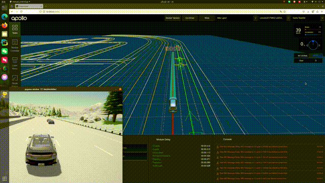
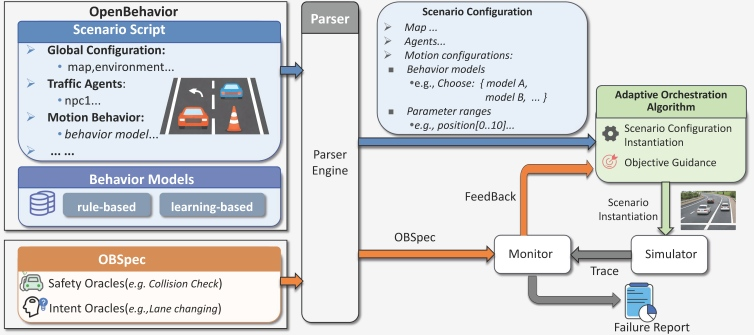
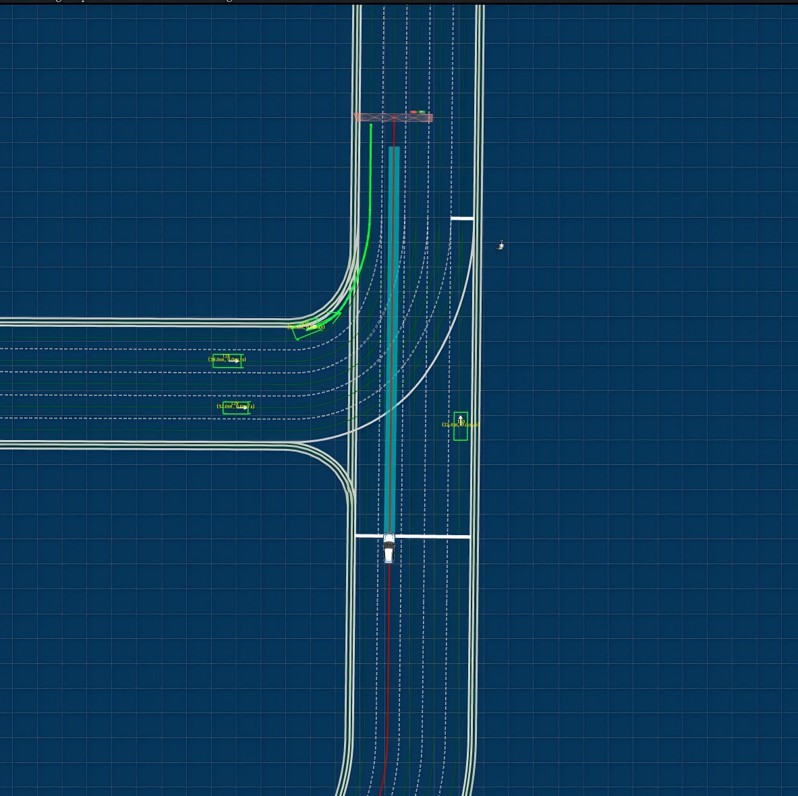
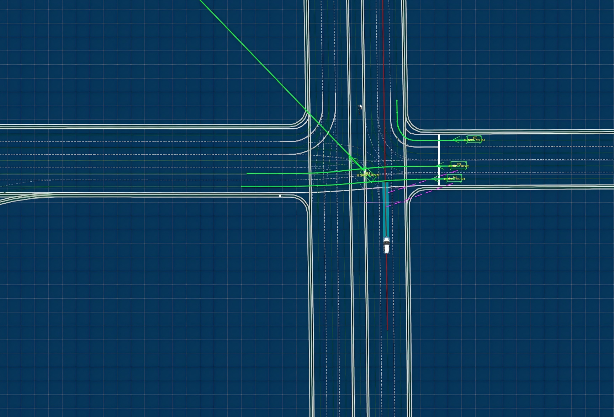
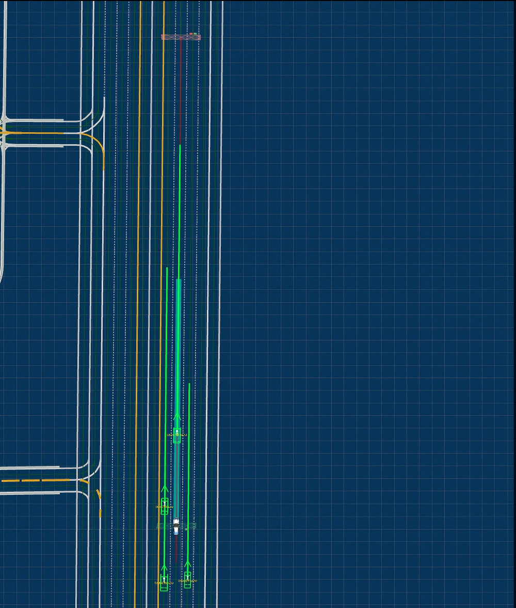
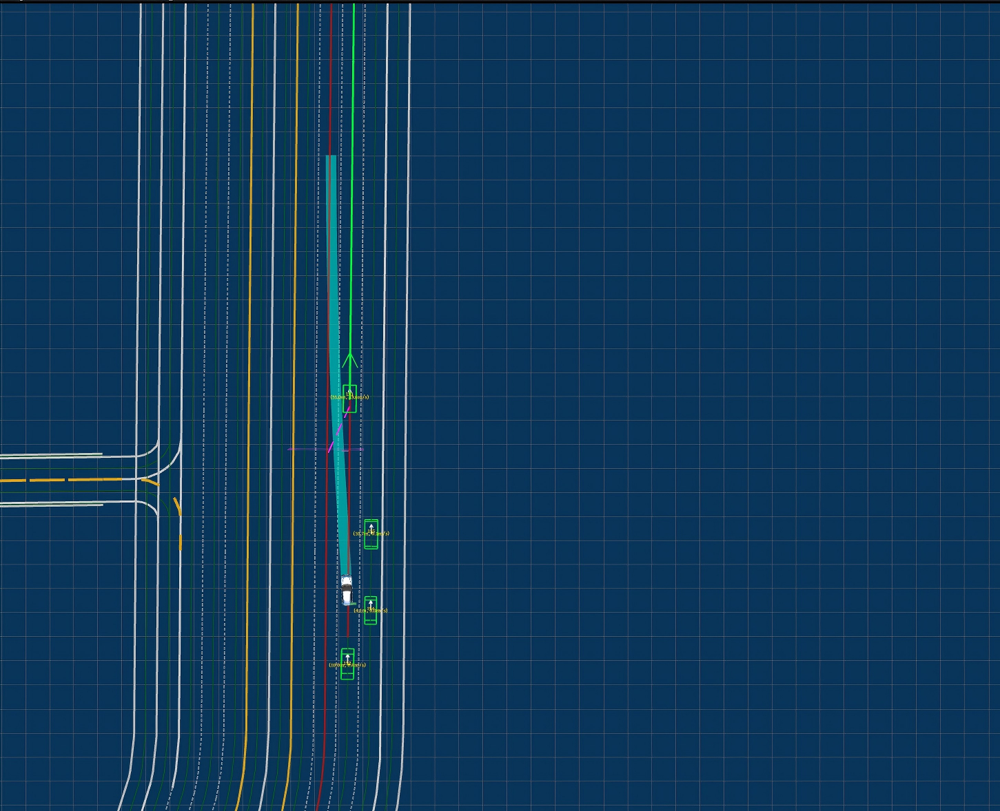

# OpenBehavior: A Behavior-Centric Scenario Description Language for Autonomous Driving Testing

<!-- PROJECT LOGO -->

<!--## [Project Page](http://www.katrinrenz.de/plant) | [Paper](https://arxiv.org/abs/2210.14222) | [Supplementary](https://www.katrinrenz.de/plant/resources/PlanT_supp.pdf) -->

<!---->


**Figure 1:** *Illustrative scenarios generated by OpenBehavior with different behavior models.*

> By integrating heterogeneous NPC behavior models, OpenBehavior enables complex multi-policy interactions that are difficult to construct manually.  In this example, a learning-based NPC decelerates, while a rule-based vehicle performs a lane change.   Their interaction leads to an unexpected failure in Apollo’s prediction module, ultimately resulting in a collision.


## Approach Overview
<!-- <p align="center">
  
</p> -->

<!-- <center></center> -->


**Figure 2:** *Overview of the OpenBehavior workflow. Users specify scenarios with a behavior-centric language and high-level
scenario intents using OBSpec, which are then instantiated
and adaptively orchestrated to generate interactive scenarios for systematic
testing of the autonomous driving system.*


## 🛣️ Functional Scenarios

We evaluate **OpenBehavior** on the following four functional scenarios related to intersections and roads in the real world:

### 🧪 Scenario Overview

<!--- **[S1 – T-Intersection](avunit/osc1/s1_t_intersection.osc)**  -->
- **S1 – T-Intersection**  
  The ego vehicle goes straight through a T-intersection.

- **S2 – Crossroad Intersection**  
  The ego vehicle turns left at a crossroad intersection.

- **S3 – Lane Following on a Straight Road**  
  The ego vehicle follows its lane on a straight road with four lanes.

- **S4 – Lane Change on a Straight Road**  
  The ego vehicle performs a lane change on a straight road with four lanes.

These scenarios are implemented using OpenBehavior and **specified** in `source_code/OpenBehavior_Osc/`.

### ⚙️ Scenario Settings

The illustrations of these four functional scenarios are shown below.

| **S1 – T-Intersection** | **S2 – Crossroad Intersection** |
| :--------------------: | :-----------------------------: |
|  |  |

| **S3 – Lane Following on a Straight Road** | **S4 – Lane Change on a Straight Road** |
| :--------------------: | :------------------------------------: |
|  |  |


<!--During testing:

- The **start position and destination of the ego vehicle** (highlighted by the red route line) are fixed.
- The **trajectories and behaviors of NPC vehicles are not predefined**, allowing diverse and dynamic interactions to emerge during testing. -->

## 📊 Experiment Results

Experimental results demonstrate that **OpenBehavior uncovers 25 distinct interaction-induced failure patterns** in Apollo, significantly outperforming existing baseline approaches.
Detailed visual demonstrations of these failures are shown below.

---

### 🎥 Discovered Failure Scenarios
### R1: Collision Avoidance
#### T-Junction (R1-T)


| R1-T1 | R1-T2 | R1-T3 |
| :---: | :---: | :---: |
|  |  |  |
| **R1-T4** | **R1-T5** | |
|  |  | |


#### Crossroad Intersection (R1-X)
<!-- <details> -->

| R1-X1 | R1-X2 | R1-X3 |
| :---: | :---: | :---: |
|  |  |  |

<!-- </details> -->

#### Straight Road (R1-L)
<!-- <details> -->

| R1-L1 | R1-L2 | R1-L3 |
| :---: | :---: | :---: |
|  |  |  |
| **R1-L4** | **R1-L5** | **R1-L6** |
|  |  |  |
| **R1-L7** | **R1-L8** | **R1-L9** |
|  |  |  |
| **R1-L10** | **R1-L11** | **R1-L12** |
|  |  |  |
| **R1-L13** | **R1-L14** |  |
|  |  |  |


<!-- </details> -->

### R2: Reaching Destination
<!-- <details> -->

| R2-1 | R2-2 | R2-3 |
| :---: | :---: | :---: |
|  |  |  |

<!-- </details> -->


### 📑 Result Data
The experimental records are organized in the `experiment_result/` directory:
* **Raw Logs:** Contains the complete execution logs for all compared methods across the four functional scenarios.
* **Data Scope:** Due to the substantial size of simulation traces (high-fidelity execution data), **representative and essential records** are prioritized in this repository.
* **Reproducibility:** All results can be **fully reproduced** by following the instructions in the [Reproduction Workflow](#-running-the-experiments) section, which automatically reruns the scenario generation and evaluation process to rediscover failure-triggering scenarios.


<!-- GETTING STARTED -->

## 🚀 Getting Started
This section describes the required environment setup and the steps to reproduce our experimental results.

### 🛠️ Experiment Setup

#### 1. Install Carla (0.9.13)
* **Download:** [Carla Releases (0.9.13)](https://github.com/carla-simulator/carla/releases)
* **Configuration:** Extract the package and add the following environment variables to your `~/.bashrc`:
    ```bash
    export CARLA_ROOT=/home/xxx/CARLA_0.9.13
    export PYTHONPATH=$PYTHONPATH:${CARLA_ROOT}/PythonAPI/carla/dist/carla-0.9.13-py3.7-linux-x86_64.egg:${CARLA_ROOT}/PythonAPI/carla/agents:${CARLA_ROOT}/PythonAPI/carla/agents/navigation:${CARLA_ROOT}/PythonAPI/carla:${CARLA_ROOT}/PythonAPI/examples:${CARLA_ROOT}/PythonAPI
    ```

#### 2. Setup Apollo 8.0
* **Clone Repository:**
    ```bash
    git clone -b v8.0.0 [https://github.com/ApolloAuto/apollo.git](https://github.com/ApolloAuto/apollo.git)
    ```
* **Installation:** Please follow the [Official Apollo Manual](https://github.com/ApolloAuto/apollo) for full installation.

#### 3. Setup Carla-Apollo Bridge
* **Source:** [MaisJamal/carla_apollo_bridge](https://github.com/MaisJamal/carla_apollo_bridge)
* **Installation:** Follow the bridge's `README.md` for specific integration steps.

---

### 📦 Environment Configuration

#### **Step A: Prepare for Scenario Runner (`scen`)**
1.  **System Dependencies:**
    ```bash
    sudo apt update && sudo apt install openjdk-17-jdk
    ```
2.  **ANTLR 4.10.1 Setup:**
    ```bash
    sudo apt curl
    curl -O https://www.antlr.org/download/antlr-4.10.1-complete.jar
    sudo cp antlr-4.10.1-complete.jar /usr/local/lib/
    sudo gedit ~/.bashrc
    # Add to ~/.bashrc
    export CLASSPATH=".:/usr/local/lib/antlr-4.10.1-complete.jar:$CLASSPATH"
    alias antlr4='java -jar /usr/local/lib/antlr-4.10.1-complete.jar'
    alias grun='java org.antlr.v4.gui.TestRig'
    source ~/.bashrc
    ```
3.  **Conda Environment:**
    ```bash
    conda create -n scen python==3.7 -y
    conda activate scen
    # Install antlr4 runtime, websocket, and graphviz
    pip install antlr4-python3-runtime==4.10 websocket websocket-client graphviz
    # Install dependency
    pip install -r requirements.txt
    ```

#### **Step B: Prepare for Judgement (`law`)**
1.  **Conda Environment:**
    ```bash
    conda create -n law python==3.7 -y
    conda activate law
    ```
2.  **Python Dependencies:**
    ```bash
    pip install -r requirements_judge.txt
    ```

---

​         

### 🛠 Running the Experiments


1.  **Run carla**

    ```bash
    ./CarlaUE4.sh
    ```


2.  **Run an OpenBehavior's scenario**

    ```bash
    conda activate scen
    
    python openbehavior_runner.py --sync  --openbehavior OpenBehavior_Osc/obehavior_s1.osc --reloadWorld
    ```
<!--original: python openbehavior_runner.py --sync  --openscenario2 OpenBehavior_Osc/avunit_s1.osc --reloadWorld -->


3. **Run OBOrchestration** <!-- original: Run OSCFuzz -->

    ```bash
   conda activate law
   
   cd judgement
   
   python OBOrchestration.py
   ```
   <!-- python OBOrchestration.py -->

   **Reproduction of OSG Data**

   You can run it by

   ```bash
   python RSGen/scripts/search/run.py
   ```

   

   **Reproduction of AVUnit**

   You can run it by

   ```bash
   python Law_Judgement/GeneticAlgorithm.py
   ```

   

[contributors-shield]: https://img.shields.io/github/contributors/othneildrew/Best-README-Template.svg?style=for-the-badge
